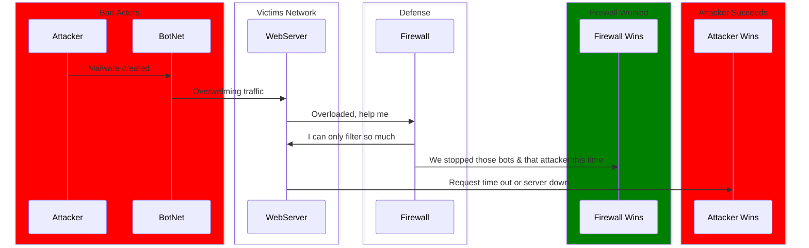

```mermaid
sequenceDiagram
 box red Bad Actors
 participant Attacker
 participant BotNet
 end
 box Victims Network
 participant WebServer
 end
 box Defense
 participant Firewall
 end
 box green Firewall Worked
 Participant Firewall Wins
 end
 box red Attacker Succeeds
 participant Attacker Wins
 end
 Attacker->>BotNet: Malware created
 BotNet->>WebServer: Overwelming traffic
 WebServer->>Firewall: Overloaded, help me
 Firewall->>WebServer: I can only filter so much
 Firewall->>Firewall Wins: We stopped those bots & that attacker this time
 WebServer->>Attacker Wins: Request time out or server down

```

