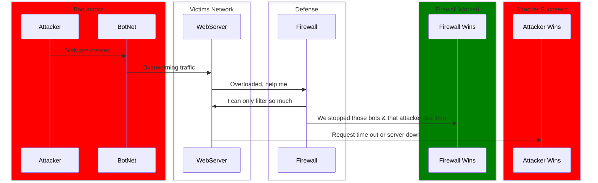

The diagram above shows the sequence of events when a hacker successfully and unsuccessfully creates a DDos attack. In the box labeled "bad actors" you will see the attacker sending out the malware to the bots, or connected devices in a company for example. Once the bots (connected devices on a network) have the malware they start to send a bunch of traffic (requests) to the webserver. From there the webserver gets overwhelmed and the firewall steps in to help filter. In this scenario of two things will happen. The firewall will do its job if it can handle it or the traffic too much and the attacker is successfully created a DDoS Attack.
